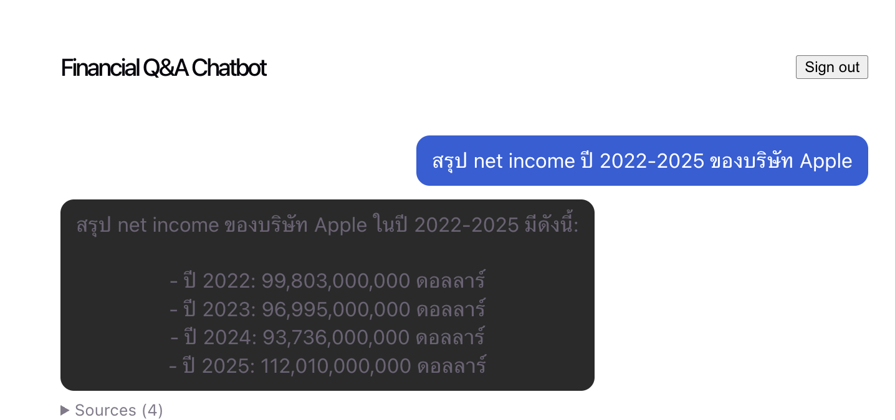
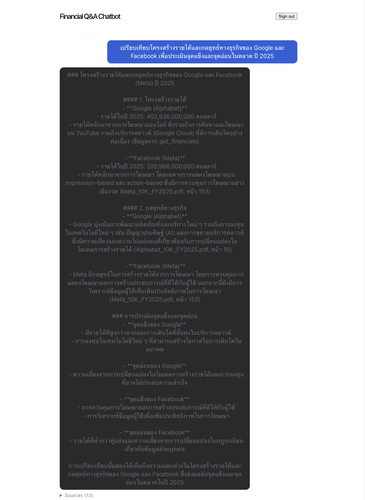
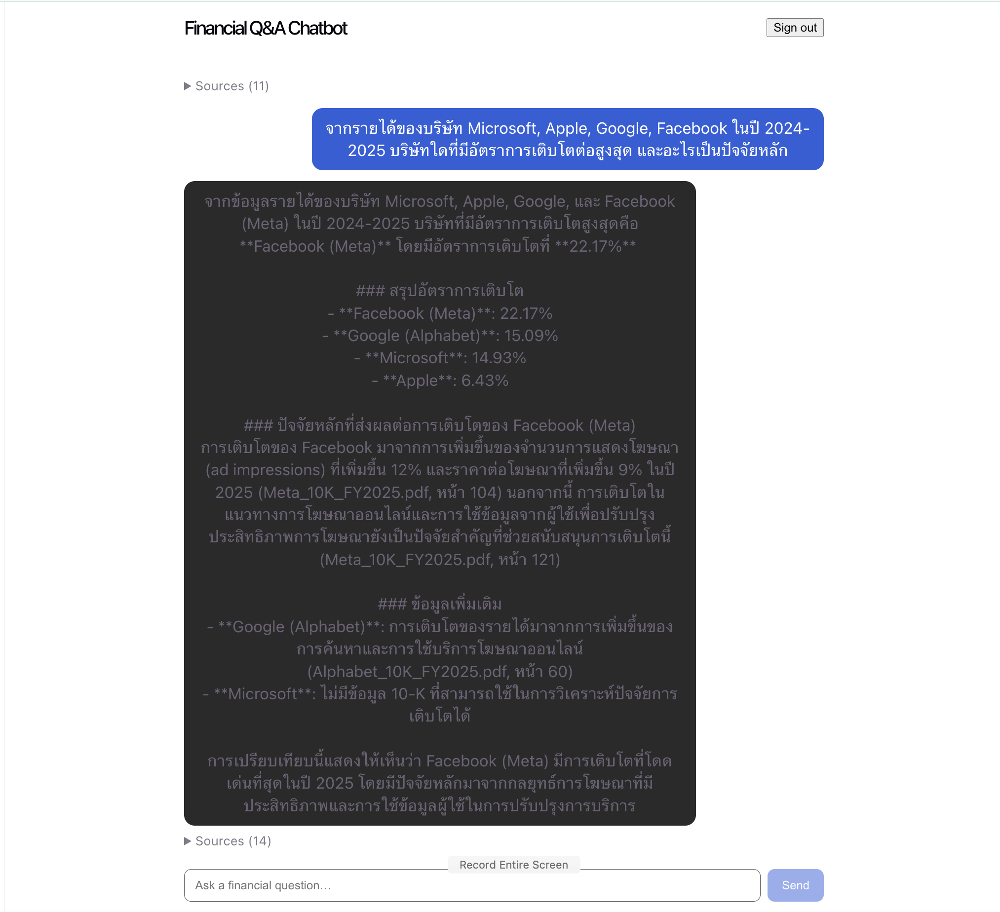

# Financial Q&A Chatbot

A grounded question-and-answer chatbot for financial questions about U.S. public companies.
Every answer is grounded in the provided data — **structured financials in PostgreSQL** and
**qualitative 10-K text in a local Pinecone index** — and the assistant is built to **refuse
rather than hallucinate** when the data isn't there.

- **Backend:** FastAPI + LangGraph agent (OpenAI `gpt-4o-mini`), JWT auth
- **Frontend:** React + Vite + TypeScript
- **Data:** PostgreSQL (income-statement figures) + Pinecone-local (10-K chunks)

📄 For a full walkthrough of the system — architecture, request lifecycle, anti-hallucination
design, security, and extensibility — see [`docs/TECH_REPORT.md`](docs/TECH_REPORT.md).

---

## Architecture at a glance

```
   React (Vite) ──JWT──▶ FastAPI  /auth/register  /auth/login  /chat  /chat/history
                                        │
                                        ▼
   LangGraph — deterministic nodes with conditional edges (app/agent/graph.py)

     extract ─▶ [needs_financials?] ─▶ sql ─▶ [needs_qualitative?] ─▶ vector ─▶ synthesize
     (LLM)      └▶ (qualitative only) ─▶ vector ─┘         └▶ synthesize ─┘        (LLM)
                                         │                                            │
                          get_financials │ (Postgres, growth computed in Python)      │ Thai/EN
                          search_filings │ (Pinecone, per-company; registry gate)     ▼
                                                                                    answer + citations
```

Routing is decided in **code**, not by the LLM. The LLM is used only at the edges — to
extract search parameters (companies, years, intent) and to phrase the final grounded
answer. This makes the anti-hallucination behaviour a property of the control flow rather
than of prompt adherence. Per question:

- **Q1** (Apple net income) → `extract → sql → synthesize` (no vector)
- **Q2** (Google vs. Facebook structure & strategy) → `extract → sql → vector → synthesize`
- **Q3** (highest growth among MSFT/AAPL/GOOG/FB + why) → same, with growth computed in
  Python and the vector step run **per company**, so only filers get factors

### Key design decisions

- **Deterministic graph, LLM at the edges.** Growth rates are computed in Python (exact, no
  LLM arithmetic), the "does this company have a filing?" gate is a real branch, and the
  non-filer fallback is structural — so the coverage trap can't be prompt-defeated.
- **Dynamic filing registry, not a hardcoded list.** `vector_registry` (Postgres) is
  populated by the ingest path (`scripts/load_vectors.py`) from the sources actually upserted
  into Pinecone, so it can never claim a filing that isn't indexed. `app/registry.py` reads
  it; adding a new 10-K (even a surprise one) needs no code change — ingest it and the router
  picks it up. The only hardcoded knowledge is the brand→filer alias (Google→Alphabet,
  Facebook→Meta), which no data source can supply.
- **Parameterized SQL, not text-to-SQL.** `query_financials(companies, years)` builds the
  query from a fixed column list — no injection surface, no hallucinated columns. SQL-name
  aliasing lives in `app/agent/aliases.py`.
- **Option A for vectors (use the fixture).** We upsert `pinecone_vectors.jsonl.gz` as-is
  rather than re-embedding — it preserves API budget and guarantees the query embedder matches
  the index (OpenAI `text-embedding-3-small` at `dimensions=512`, see `vector_client.py`).
- **Anti-hallucination.** `synthesize_node` is handed a structured DATA CONTEXT (SQL rows,
  computed growth, 10-K excerpts, and an explicit "NO 10-K FILING AVAILABLE" list) and told to
  use nothing else. Microsoft (SQL numbers, no 10-K) gets its number and an explicit "no
  filing" note; a company with a filing but no matching passage reads differently.
- **Citations flow to the UI.** Every answer returns the SQL rows and 10-K chunks it used;
  the frontend renders them under each answer as proof of grounding.
- **Auth is a separable module** (`app/auth/`) — JWT + bcrypt, `OAuth2PasswordBearer` guarding
  the chat routes — so roles/refresh-tokens/OAuth can be added without touching the graph.

### Data coverage (important)

| Source | Coverage |
| --- | --- |
| PostgreSQL (`financial_data`) | ~49 companies, FY2022–2025, income-statement figures |
| Pinecone (10-K text) | **Only 4 filings:** Alphabet, Amazon, Apple, Meta (all FY2025) |

A company can have financials but no filing text (e.g. Microsoft). The assistant answers the
numeric part and clearly says no 10-K text is available for the qualitative part.

---

## Prerequisites

- Docker + Docker Compose
- Python 3.11+ (tested on 3.13)
- Node.js 20+
- An OpenAI API key (used for the LLM and for query-time embeddings)

## Setup

### 1. Configure environment

```bash
cp .env.example .env
# then set OPENAI_API_KEY and a JWT_SECRET_KEY in .env
```

`.env` (defaults already match `docker-compose.yml`):

| Variable | Purpose |
| --- | --- |
| `OPENAI_API_KEY` | LLM + query embeddings (**required**) |
| `DATABASE_URL` | Postgres DSN (default matches compose) |
| `PINECONE_API_KEY` / `PINECONE_HOST` / `PINECONE_INDEX_NAME` | pinecone-local (defaults fine) |
| `JWT_SECRET_KEY` | Signs auth tokens (**set to a random string**) |

### 2. Bring up the databases

```bash
docker compose up -d
```

This starts:
- **Postgres** on `:5432` — `data/financial_data.sql` is auto-loaded on first boot via
  `docker-entrypoint-initdb.d` (192 rows).
- **Pinecone-local** on `:5080` — an ephemeral in-memory index (no persistence).

> **Apple Silicon notes:** the compose file pins `postgres:16-alpine` (the Debian
> `postgres:16` image segfaults in `initdb` under Docker Desktop on Apple Silicon) and
> `pinecone-local:v0.7.0` (the `:latest` tag tracks a v1.0.0 release candidate that
> segfaults under x86 emulation). Both run cleanly. Enable **Docker Desktop → Settings →
> Use Rosetta for x86/amd64 emulation** for the smoothest experience.

Verify the SQL loaded:

```bash
docker exec smc-postgres psql -U smc -d smc -c "SELECT count(*) FROM financial_data;"  # 192
```

### 3. Load the vectors

pinecone-local has no persistence, so **re-run this after every `docker compose up`**:

```bash
cd backend
python3 -m venv .venv && source .venv/bin/activate
pip install -r requirements.txt
python -m scripts.load_vectors      # creates the index and upserts the fixture
```

### 4. Run the backend

```bash
# from backend/, with the venv active and databases up
uvicorn app.main:app --reload --port 8000
```

API docs at http://localhost:8000/docs.

### 5. Run the frontend

```bash
cd frontend
npm install
npm run dev        # http://localhost:5173
```

Open http://localhost:5173, register an account, sign in, and ask away.

---

## Validating Q1–Q3

Register/login, then ask (Thai — the assistant answers in the user's language):

- **Q1:** สรุป net income ปี 2022-2025 ของบริษัท Apple
- **Q2:** เปรียบเทียบโครงสร้างรายได้และกลยุทธ์ทางธุรกิจของ Google และ Facebook เพื่อประเมินจุดแข็งและจุดอ่อนในตลาด ปี 2025
- **Q3:** จากรายได้ของบริษัท Microsoft, Apple, Google, Facebook ในปี 2024-2025 บริษัทใดที่มีอัตราการเติบโตต่อสูงสุด และอะไรเป็นปัจจัยหลัก

**Negative / refusal case** — proves no-hallucination behavior (not in the data):

- What was Tesla's R&D spend? → the assistant states it has no such data rather than inventing a figure.

Q3 is the deliberate coverage trap: Microsoft has SQL revenue but **no 10-K text**. A correct
answer computes the growth rate for all four companies (Meta is highest at ~22%), reports
Microsoft's numbers, and explicitly declines to give a qualitative "why" for Microsoft rather
than inventing one.

### Screenshots from the running app

**Q1 — Apple net income 2022–2025** (SQL only, figures cited per year):



**Q2 — Google vs. Facebook revenue structure & strategy** (SQL + 10-K excerpts, cited by file and page):



**Q3 — highest growth 2024–2025** (growth computed in Python, Meta leads at 22.17%; note the explicit "no 10-K available" line for Microsoft — the anti-hallucination behaviour in action):



---

## Troubleshooting

- **`role "smc" does not exist` on backend startup** — a native Postgres on your host is
  occupying port 5432 and shadowing the container. Stop it (`brew services stop postgresql@14`)
  or remap the container's published port in `docker-compose.yml`.
- **`SSL: WRONG_VERSION_NUMBER` when loading/querying vectors** — pinecone-local advertises its
  index host as `https://` but serves plaintext `http`. The code rewrites the scheme for local
  hosts; if you point at a real Pinecone, keep `https`.
- **Vector search returns nothing** — pinecone-local is in-memory and wiped on restart. Re-run
  `python -m scripts.load_vectors`.
- **A DB container exits 139 (segfault)** — see the Apple Silicon notes above; use the pinned
  image tags and enable Rosetta.

---

## Project layout

```
backend/
  app/
    main.py              FastAPI app + CORS + startup table creation
    config.py            pydantic-settings, reads ../.env
    db.py, models.py     SQLAlchemy engine + User/Message/VectorRegistry models
    schemas.py           Pydantic request/response + citation shapes
    registry.py          dynamic "which companies have a 10-K" lookup (reads vector_registry)
    auth/                register/login, JWT, bcrypt, OAuth2 dependency
    chat/                chat + history routes, orchestration + citation building
    agent/
      graph.py           LangGraph nodes + conditional edges (extract→sql→vector→synthesize)
      tools.py           query_financials (SQL) + search_filings (Pinecone)
      vector_client.py   OpenAI embeddings + Pinecone client
      aliases.py         SQL-name aliasing (Google↔Alphabet / Facebook↔Meta)
      prompts.py         extraction + synthesis prompts
  scripts/load_vectors.py  upserts the Pinecone fixture (Option A) + registers sources
frontend/
  src/auth/              auth context + login/register page
  src/chat/              chat page, message list, input, citation panel
  src/api/               typed fetch client
docker-compose.yml       postgres + pinecone-local
data/                    financial_data.sql, pinecone_vectors.jsonl.gz
```

## Notes

- Vectors are **not persisted** — re-run `scripts.load_vectors` after each compose restart.
- The OpenAI budget for the task is small; Option A avoids re-embedding, so only query-time
  embeddings and LLM calls consume it.
